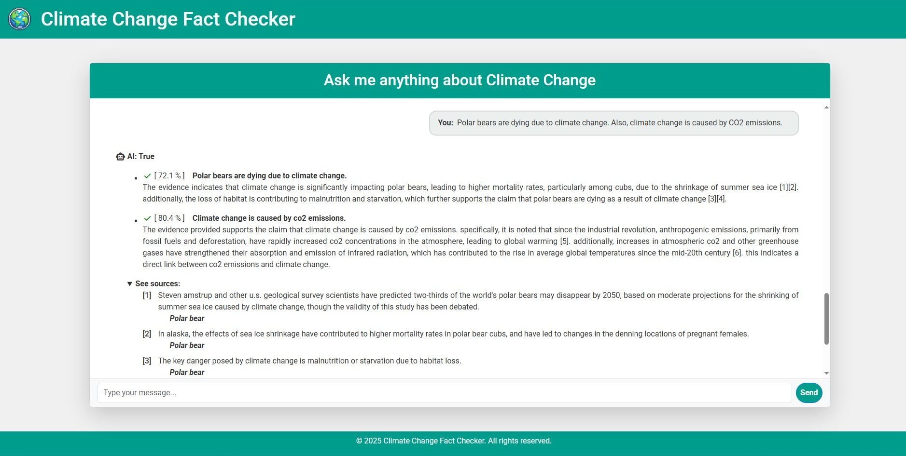
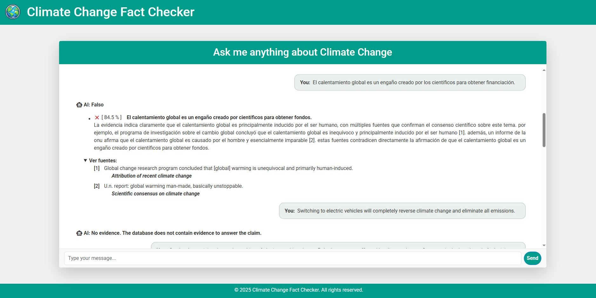
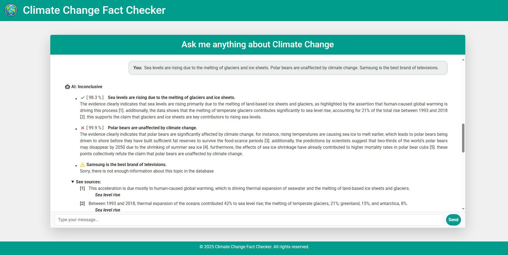

# Fact Verification System ✔️

This project is a Fact Verification System leveraging Large Language Models (LLMs) and Retrieval-Augmented Generation (RAG) frameworks. The system validates factual claims related to climate change by combining natural language processing, intelligent query decomposition, and providing detailed explanations and source referencing.

---

## 🌍 Overview

This system was developed as part of the NLP module for the subject *Procesamiento del Lenguaje Natural*. The core idea is to verify factual claims related to **climate change**, using the **Climate-FEVER** dataset — a collection of 1535 claims and 7675 evidence snippets annotated with labels indicating support, refutation, or lack of evidence.

**Main Features:**
- **Atomic decomposition** of input queries using Few-Shot Prompting
- **Retrieval-Augmented Generation** pipeline using **ChromaDB** and **LlamaIndex**
- **Multilingual support** via translation (input and output)
- **Confidence scoring** using a modified **FACT Score**
- **Explainable and source-referenced answers** using Vancouver citation style

---

## ⚙️ How to Run ▶️

1. Install all dependencies (recommended using Conda):

    ```bash
    conda env create -f environment.yml
    conda activate fact-verification
    ```

2. Run the following command to start the verification system:

    ```bash
    python main.py
    ```

---

## 🧠 Technologies & Design Decisions

- **Vector Database**: [ChromaDB](https://www.trychroma.com/) for simplicity and flexibility.
- **Embeddings Model**: `all-MiniLM-L6-v2` (small but highly effective transformer).
- **LLM Interface**: LlamaIndex, interfacing with **Llama3.2** (or fallback to **GPT-4o-mini**).
- **Atomic claim splitting** for precise verification of multi-fact inputs.
- **Few-Shot Prompting** guides the LLM through:
  - Claim decomposition
  - Individual fact verification
  - Final verdict generation
- **Multilingual Translation**: Input translated to English; output translated back to original language using the same LLM.

---

## 📊 Evaluation

### ✅ Veracity Classification (75 queries manually labeled)

| Class      | Precision | Recall | F1-Score | Instances |
|------------|-----------|--------|----------|-----------|
| Other      | 0.96      | 0.75   | 0.84     | 32        |
| Refute     | 0.80      | 0.95   | 0.87     | 21        |
| Support    | 0.88      | 1.00   | 0.94     | 22        |
| **Average**| **0.88**  | **0.90** | **0.88** | **75**     |

### 🔍 Textual Similarity and Inference

| Metric       | Value  |
|--------------|--------|
| BERTScore Precision Avg. | 0.871  |
| BERTScore Recall Avg.    | 0.930  |
| BERTScore F1 Avg.        | 0.898  |
| FACT Score               | 0.657  |

### ⏱️ Response Time

| Condition         | Avg. Time |
|-------------------|-----------|
| Without Translation | 2.77 s    |
| With Translation    | 10.25 s   |

---

## 🔬 Limitations

- **Refute class** shows lower precision due to limitations of the embedding model in retrieving negative evidence.
- **Other class** has lower recall, likely due to the complexity of identifying when evidence is truly insufficient.
- **Evaluation** was conducted only in English; performance in other languages may vary.
- **Translation** is implemented as a non-essential feature and not evaluated as strictly.

---

## 👨‍💻 Contributors

The implemented system in this repository was developed by:

- **Rubén Cid Costa**
- **Guillermo Grande Santi**
- **Jaime Ruiz Salcedo**
- **Jesús Martín Trilla**

---

## 📸 Demonstration

Below are screenshots illustrating the functioning of the system:

<!-- Add your 3 screenshots here -->
1. Firstly, we can see how it divides the sentence into smaller claims, provides a confidence level and shows the sources from which it got the information:



2. The next claims demonstrate its multilingual support and how it rejects answering in case it doesn't have enough information:



3. Lastly, we can see an example with contradicting sentences:



---

## 📄 License

This project is released under the MIT License.
